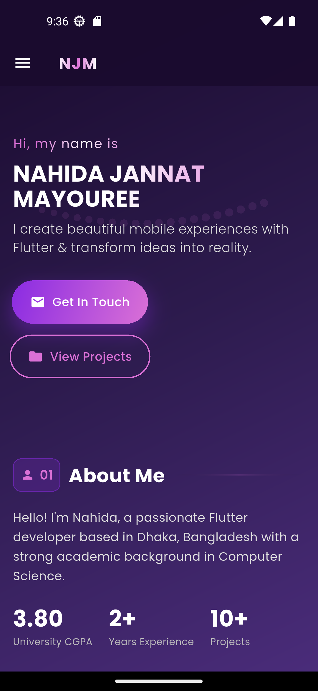
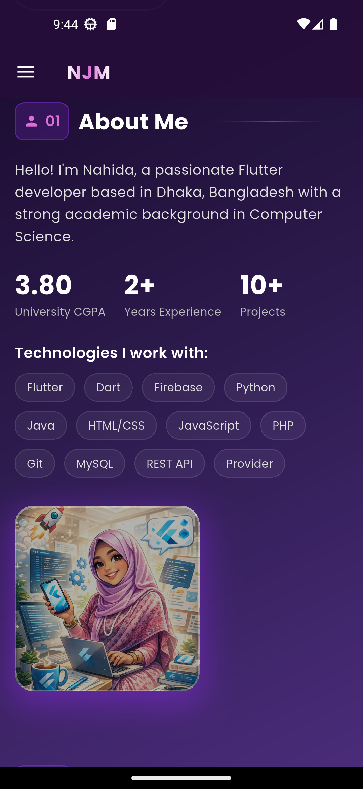
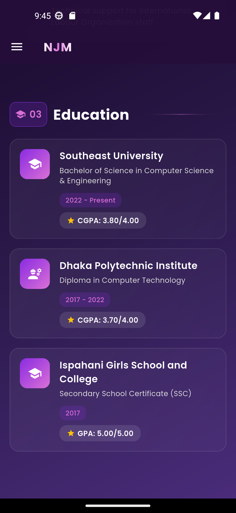
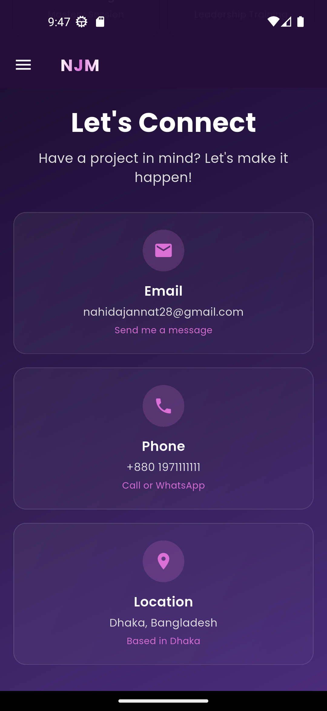
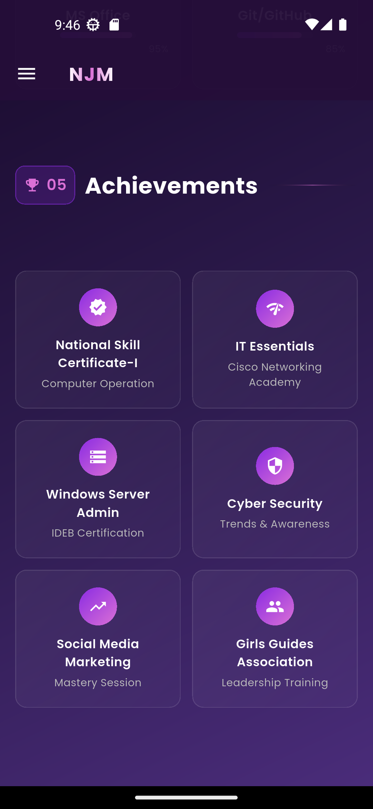
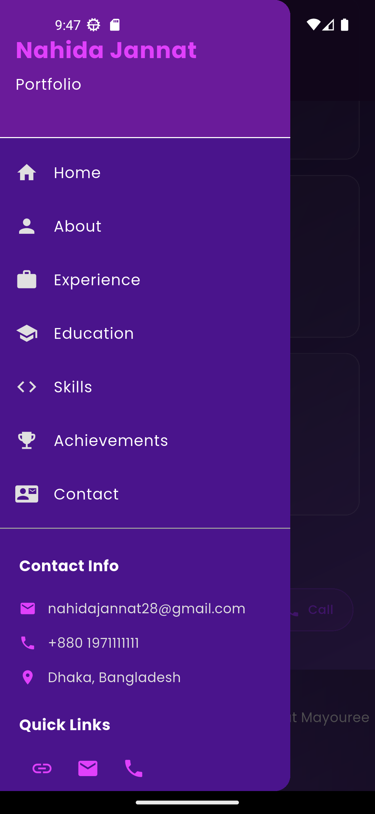
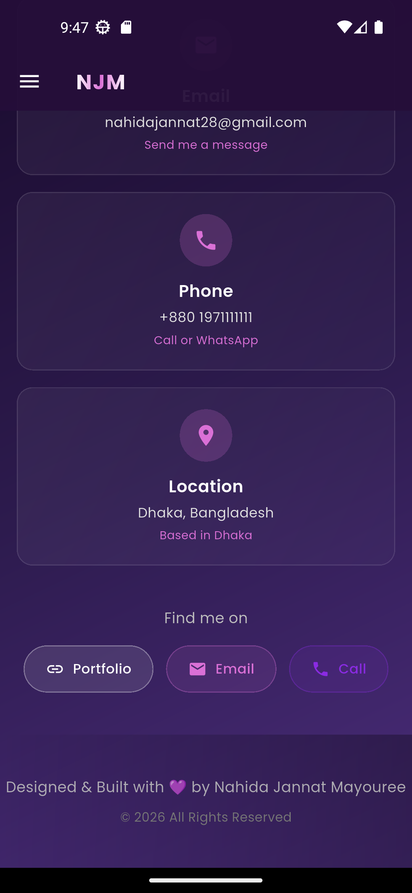
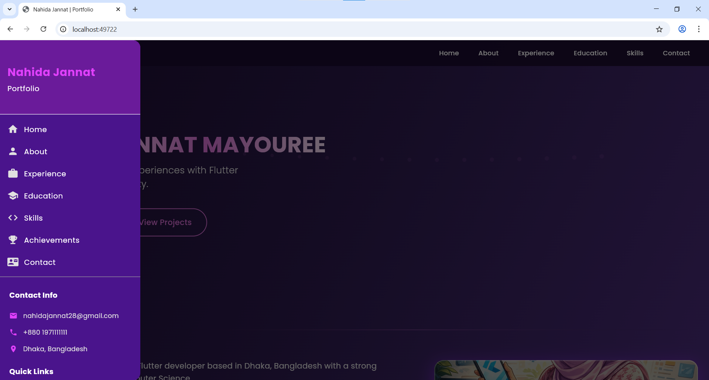

# Nahida Jannat - Flutter Portfolio App

A beautiful, responsive portfolio application built with Flutter showcasing my skills, experience, and projects as a mobile developer.
https://img.shields.io/badge/Flutter-3.13+-02569B?logo=flutter&logoColor=white
https://img.shields.io/badge/Dart-3.0+-0175C2?logo=dart&logoColor=white
https://img.shields.io/badge/License-MIT-blue

## 📱 Screenshots

### Mobile View
| Home                                                       | About | Skills |
|------------------------------------------------------------|-------|--------|
|  |  |  |

| Experience                                                 | Education | Contact |
|------------------------------------------------------------|-----------|---------|
|  |  |  |


| Achievements                                               | Side Menu                                                | Footer                                                        |
|------------------------------------------------------------|----------------------------------------------------------|---------------------------------------------------------------|
|  |  |  |

### Desktop View


## ✨ Features

- **🎨 Modern UI** - Beautiful gradient design with purple theme
- **📱 Fully Responsive** - Adapts to mobile, and desktop screens
- **✨ Smooth Animations** - Built with `flutter_animate` package
- **🌓 Dark Theme** - Elegant dark mode with gradient accents
- **📄 Multi-section Portfolio**:
    - Hero/Introduction section
    - About Me with stats
    - Work Experience timeline
    - Education history
    - Skills with progress bars
    - Achievements showcase
    - Contact information

## 🛠️ Technologies Used

- **Flutter 3.13+** - Cross-platform framework
- **Dart 3.0+** - Programming language
- **Google Fonts** - Custom typography with Poppins
- **URL Launcher** - External link handling
- **Flutter Animate** - Smooth animations
- **Shimmer** - Loading effects

## 📦 Installation & Setup

### Prerequisites
- Flutter SDK (version 3.13 or higher)
- Dart (version 3.0 or higher)
- Android Studio / VS Code with Flutter extension
- Git

### Steps to Run

1. **Clone the repository**
   ```bash
   git clone https://github.com/Nahida-Jannat/portfolio-app.git
   cd portfolio-app
   ```

2. **Install dependencies**
   ```bash
   flutter pub get
   ```

3. **Run the app**
   ```bash
   # For Android
   flutter run -d android
   
   # For iOS
   flutter run -d ios
   
   # For web
   flutter run -d chrome
   ```

4. **Build for release**
   ```bash
   # Android APK
   flutter build apk --release
   
   # Android App Bundle
   flutter build appbundle --release
   
   # iOS
   flutter build ios --release
   
   # Web
   flutter build web --release
   ```

## 📁 Project Structure

```
lib/
├── main.dart                    # App entry point
├── home_screen.dart            # Main portfolio screen
├── widgets/
│   ├── side_menu.dart          # Navigation drawer
│   └── custom_app_bar.dart     # Responsive app bar
assets/
├── images/
│   ├── profile1.png            # Profile picture
│   └── app_icon.png           # App launcher icon
```

## 🎯 Customization

### Change Personal Information
Edit the following files to update your personal details:

1. **`home_screen.dart`** - Update:
    - Name in Hero section
    - About me description
    - Experience data in `_experiences` list
    - Education data in `educationData` list
    - Skills and percentages in `skills` list
    - Contact information

2. **`main.dart`** - Update:
    - App title
    - Theme colors

### Change Theme Colors
Modify the color scheme in `main.dart`:
```dart
primaryColor: const Color(0xFF8A2BE2),      // Primary purple
accentColor: const Color(0xFFDA70D6),       // Accent pink
backgroundColor: const Color(0xFF0A0618),   // Dark background
```

### Add Your Profile Image
1. Place your image in `assets/images/profile1.png`
2. Ensure it's properly referenced in `_buildProfileImage()` method

## 📱 Responsive Design

The app automatically adapts to different screen sizes:
- **Mobile**: < 600px (single column layout)
- **Desktop**: > 1024px (multi-column layout)

## 🔧 Dependencies

Check `pubspec.yaml` for the complete list:

```yaml
dependencies:
  flutter:
    sdk: flutter
  google_fonts: ^6.3.3      # Custom fonts
  url_launcher: ^6.3.2      # Open URLs/email/phone
  flutter_animate: ^4.5.2   # Animations
  shimmer: ^3.0.0          # Shimmer effects
```

## 🚀 Features Implementation Details

### 1. **Responsive Navigation**
- Custom app bar with scroll effects
- Side drawer for mobile devices
- Section-based navigation

### 2. **Animated Elements**
- Particle background effects
- Floating profile image
- Gradient text animations
- Progress bar animations

### 3. **Interactive Components**
- Clickable contact cards
- Social media buttons
- Email/Phone/URL launchers
- Smooth scroll navigation

## 📄 License

This project is licensed under the MIT License - see the [LICENSE](LICENSE) file for details.

## 👩‍💻 Author

**Nahida Jannat Mayouree**
- 📧 Email: nahidajannat28@gmail.com
- 🌐 Portfolio: [GitHub](https://github.com/Nahida-Jannat)
- 📍 Location: Dhaka, Bangladesh


## 🙏 Acknowledgments

- Flutter team for the amazing framework
- Google Fonts for typography
- All package maintainers
- Inspiration from modern portfolio designs

## 📊 Stats


---

⭐ Star this repo if you found it useful!

Made with ❤️ using Flutter